# Temperature Sensitivity Analysis

This report summarizes the **first temperature sensitivity analysis** using **Weighted Precision, Weighted Recall, and Weighted F1-score** only.

Method summary:
- Each figure uses the **median** across the 5 folds at each temperature.
- Sensitivity is interpreted from the **temperature medians across the different folds**.
- Let `m(T)` denote the median Weighted F1 at temperature `T`.
- The measures are computed as follows:

```text
Absolute gap = max_T m(T) - min_T m(T)

Relative variation (%) = [Absolute gap / median_T m(T)] * 100
```
- The short analysis below each figure focuses on the practical gap in **Weighted F1** across temperatures.

### Zero-Shot LLMs Summary

| Model | Highest T | Highest Median W-F1 | Lowest T | Lowest Median W-F1 | Absolute Gap | Relative Variation |
| --- | ---: | ---: | ---: | ---: | ---: | ---: |
| ChatGPT Zero-Shot | 0.0 | 0.787 | 0.6 | 0.779 | 0.008 | 1.00% |
| Claude Zero-Shot | 0.2 | 0.733 | 0.5 | 0.723 | 0.010 | 1.34% |
| DeepSeek Zero-Shot | 0.2 | 0.787 | 0.5 | 0.781 | 0.005 | 0.70% |
| Gemini Zero-Shot | 0.0 | 0.797 | 0.6 | 0.785 | 0.012 | 1.52% |
| Gemma Zero-Shot | 0.2 | 0.762 | 0.6 | 0.753 | 0.009 | 1.17% |
| Qwen Zero-Shot | 0.0 | 0.680 | 0.4 | 0.664 | 0.016 | 2.37% |

## Zero-Shot LLMs

<table>

<tr>
<td valign="top" width="33%">
<p><strong>ChatGPT Zero-Shot</strong></p>
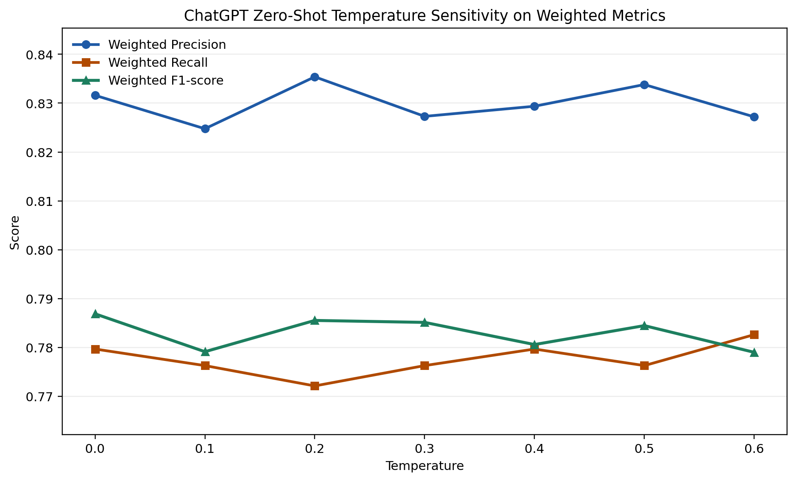
<p>The median Weighted F1 varies from <strong>0.779</strong> at <strong>T=0.6</strong> to <strong>0.787</strong> at <strong>T=0.0</strong>, yielding an absolute gap of <strong>0.008</strong> and a relative variation of <strong>1.00%</strong>. Weighted Precision varies by <strong>0.011</strong> across temperatures, and Weighted Recall varies by <strong>0.010</strong>.</p>
</td>
<td valign="top" width="33%">
<p><strong>Claude Zero-Shot</strong></p>
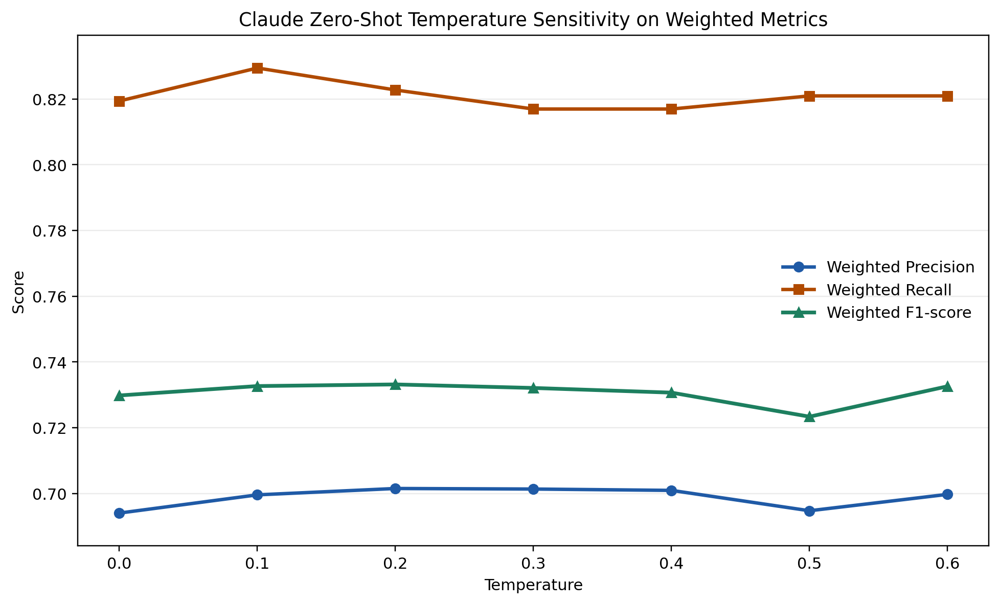
<p>The median Weighted F1 varies from <strong>0.723</strong> at <strong>T=0.5</strong> to <strong>0.733</strong> at <strong>T=0.2</strong>, yielding an absolute gap of <strong>0.010</strong> and a relative variation of <strong>1.34%</strong>. Weighted Precision varies by <strong>0.007</strong> across temperatures, and Weighted Recall varies by <strong>0.012</strong>.</p>
</td>
<td valign="top" width="33%">
<p><strong>DeepSeek Zero-Shot</strong></p>
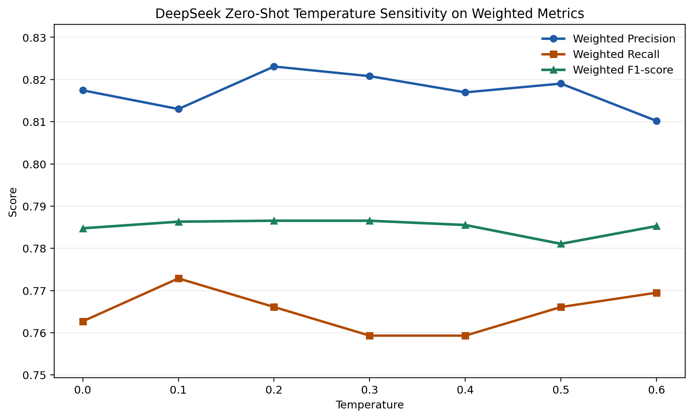
<p>The median Weighted F1 varies from <strong>0.781</strong> at <strong>T=0.5</strong> to <strong>0.787</strong> at <strong>T=0.2</strong>, yielding an absolute gap of <strong>0.005</strong> and a relative variation of <strong>0.70%</strong>. Weighted Precision varies by <strong>0.013</strong> across temperatures, and Weighted Recall varies by <strong>0.014</strong>.</p>
</td>
</tr>

<tr>
<td valign="top" width="33%">
<p><strong>Gemini Zero-Shot</strong></p>
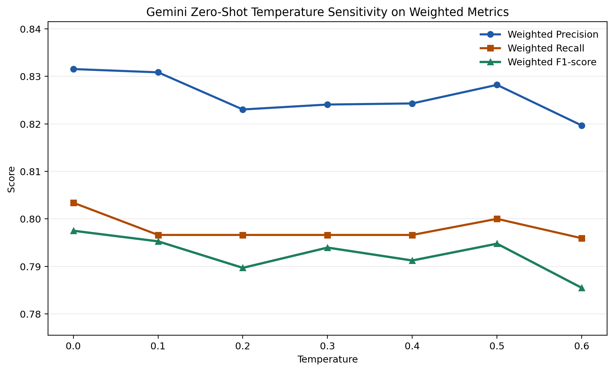
<p>The median Weighted F1 varies from <strong>0.785</strong> at <strong>T=0.6</strong> to <strong>0.797</strong> at <strong>T=0.0</strong>, yielding an absolute gap of <strong>0.012</strong> and a relative variation of <strong>1.52%</strong>. Weighted Precision varies by <strong>0.012</strong> across temperatures, and Weighted Recall varies by <strong>0.007</strong>.</p>
</td>
<td valign="top" width="33%">
<p><strong>Gemma Zero-Shot</strong></p>
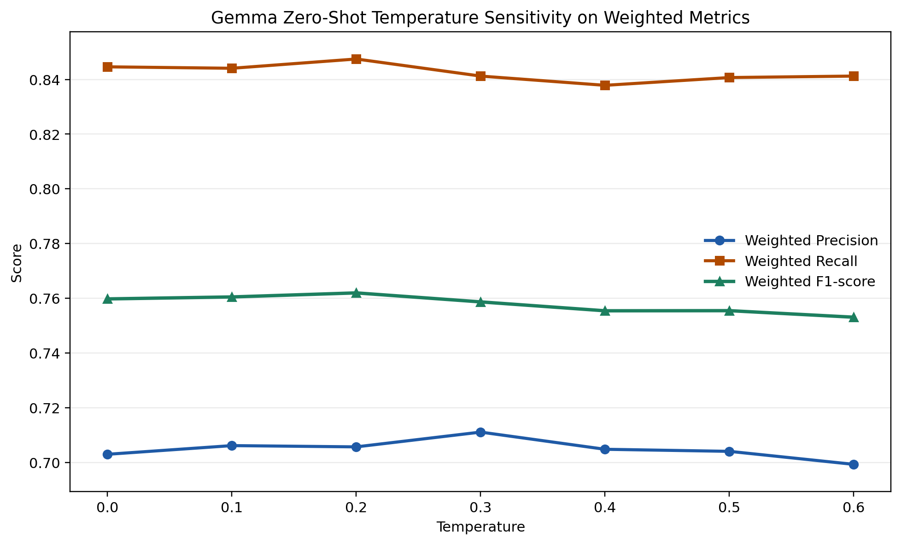
<p>The median Weighted F1 varies from <strong>0.753</strong> at <strong>T=0.6</strong> to <strong>0.762</strong> at <strong>T=0.2</strong>, yielding an absolute gap of <strong>0.009</strong> and a relative variation of <strong>1.17%</strong>. Weighted Precision varies by <strong>0.012</strong> across temperatures, and Weighted Recall varies by <strong>0.010</strong>.</p>
</td>
<td valign="top" width="33%">
<p><strong>Qwen Zero-Shot</strong></p>
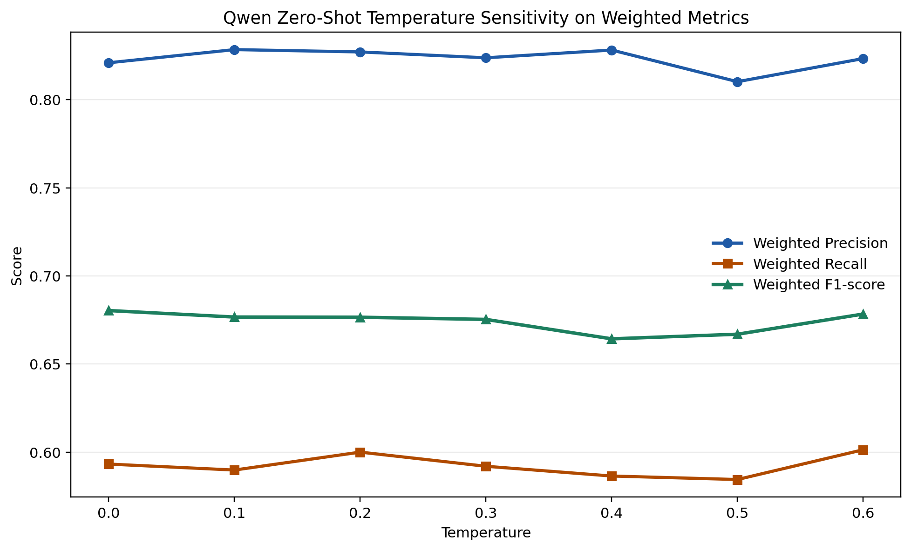
<p>The median Weighted F1 varies from <strong>0.664</strong> at <strong>T=0.4</strong> to <strong>0.680</strong> at <strong>T=0.0</strong>, yielding an absolute gap of <strong>0.016</strong> and a relative variation of <strong>2.37%</strong>. Weighted Precision varies by <strong>0.018</strong> across temperatures, and Weighted Recall varies by <strong>0.017</strong>.</p>
</td>
</tr>

</table>

### Few-Shot LLMs Summary

| Model | Highest T | Highest Median W-F1 | Lowest T | Lowest Median W-F1 | Absolute Gap | Relative Variation |
| --- | ---: | ---: | ---: | ---: | ---: | ---: |
| ChatGPT Few-Shot | 0.6 | 0.819 | 0.5 | 0.811 | 0.008 | 0.96% |
| Claude Few-Shot | 0.5 | 0.774 | 0.0 | 0.763 | 0.011 | 1.49% |
| DeepSeek Few-Shot | 0.4 | 0.832 | 0.1 | 0.821 | 0.012 | 1.42% |
| Gemini Few-Shot | 0.3 | 0.813 | 0.5 | 0.811 | 0.002 | 0.24% |
| Gemma Few-Shot | 0.3 | 0.790 | 0.2 | 0.785 | 0.005 | 0.60% |
| Qwen Few-Shot | 0.1 | 0.789 | 0.5 | 0.777 | 0.012 | 1.52% |

## Few-Shot LLMs

<table>

<tr>
<td valign="top" width="33%">
<p><strong>ChatGPT Few-Shot</strong></p>
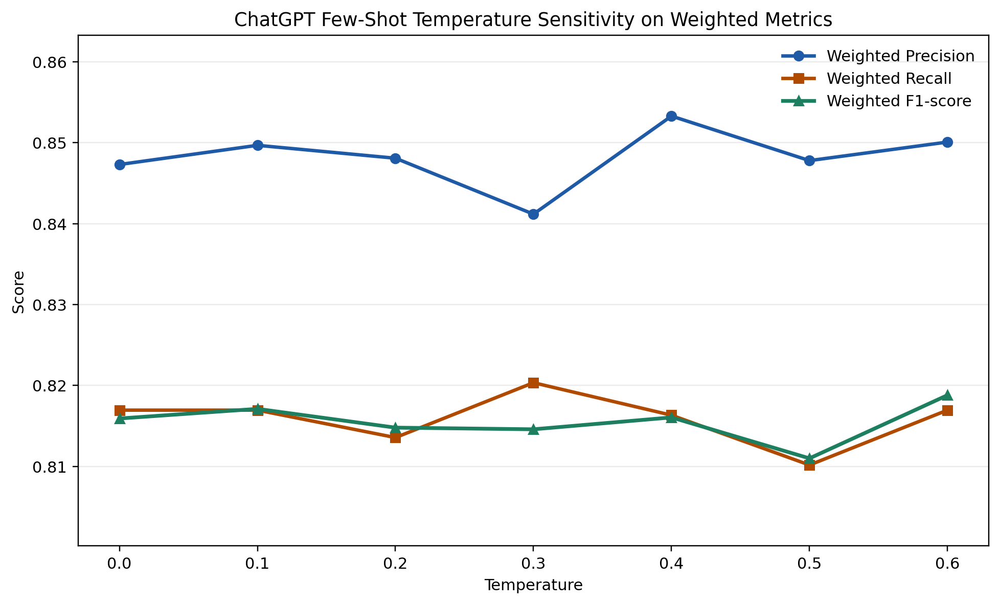
<p>The median Weighted F1 varies from <strong>0.811</strong> at <strong>T=0.5</strong> to <strong>0.819</strong> at <strong>T=0.6</strong>, yielding an absolute gap of <strong>0.008</strong> and a relative variation of <strong>0.96%</strong>. Weighted Precision varies by <strong>0.012</strong> across temperatures, and Weighted Recall varies by <strong>0.010</strong>.</p>
</td>
<td valign="top" width="33%">
<p><strong>Claude Few-Shot</strong></p>
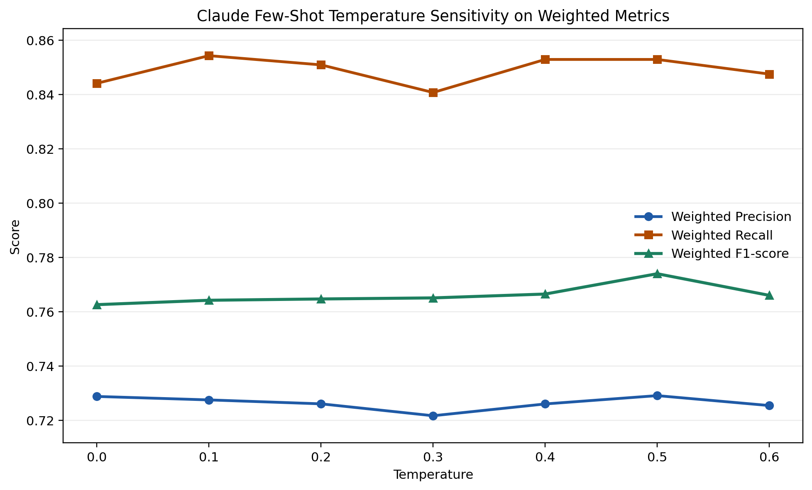
<p>The median Weighted F1 varies from <strong>0.763</strong> at <strong>T=0.0</strong> to <strong>0.774</strong> at <strong>T=0.5</strong>, yielding an absolute gap of <strong>0.011</strong> and a relative variation of <strong>1.49%</strong>. Weighted Precision varies by <strong>0.007</strong> across temperatures, and Weighted Recall varies by <strong>0.014</strong>.</p>
</td>
<td valign="top" width="33%">
<p><strong>DeepSeek Few-Shot</strong></p>
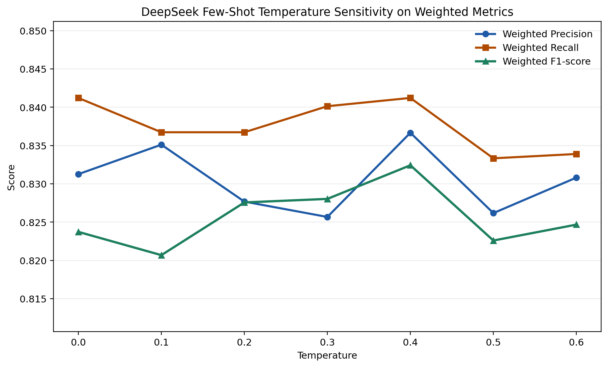
<p>The median Weighted F1 varies from <strong>0.821</strong> at <strong>T=0.1</strong> to <strong>0.832</strong> at <strong>T=0.4</strong>, yielding an absolute gap of <strong>0.012</strong> and a relative variation of <strong>1.42%</strong>. Weighted Precision varies by <strong>0.011</strong> across temperatures, and Weighted Recall varies by <strong>0.008</strong>.</p>
</td>
</tr>

<tr>
<td valign="top" width="33%">
<p><strong>Gemini Few-Shot</strong></p>
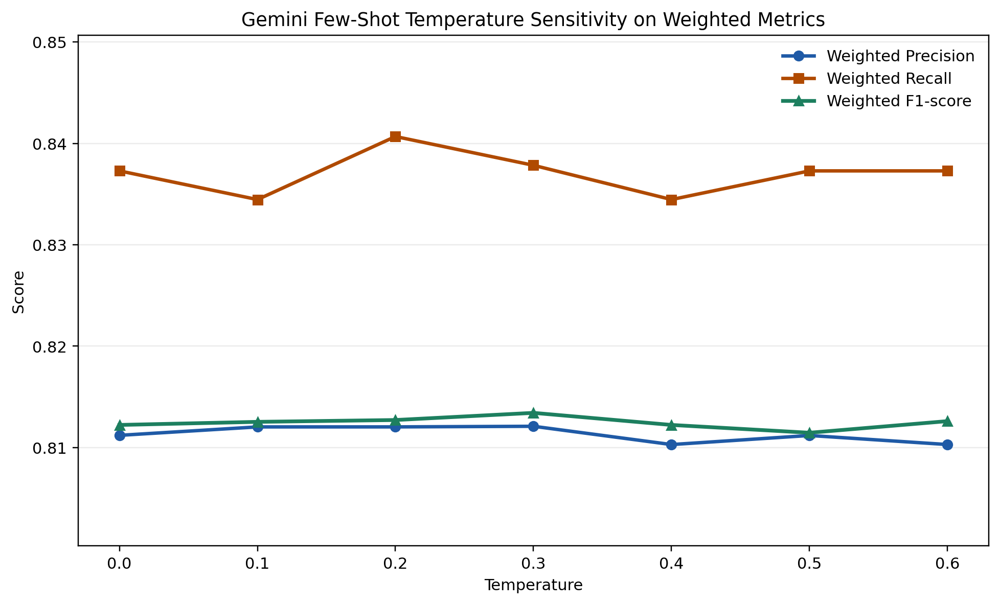
<p>The median Weighted F1 varies from <strong>0.811</strong> at <strong>T=0.5</strong> to <strong>0.813</strong> at <strong>T=0.3</strong>, yielding an absolute gap of <strong>0.002</strong> and a relative variation of <strong>0.24%</strong>. Weighted Precision varies by <strong>0.002</strong> across temperatures, and Weighted Recall varies by <strong>0.006</strong>.</p>
</td>
<td valign="top" width="33%">
<p><strong>Gemma Few-Shot</strong></p>
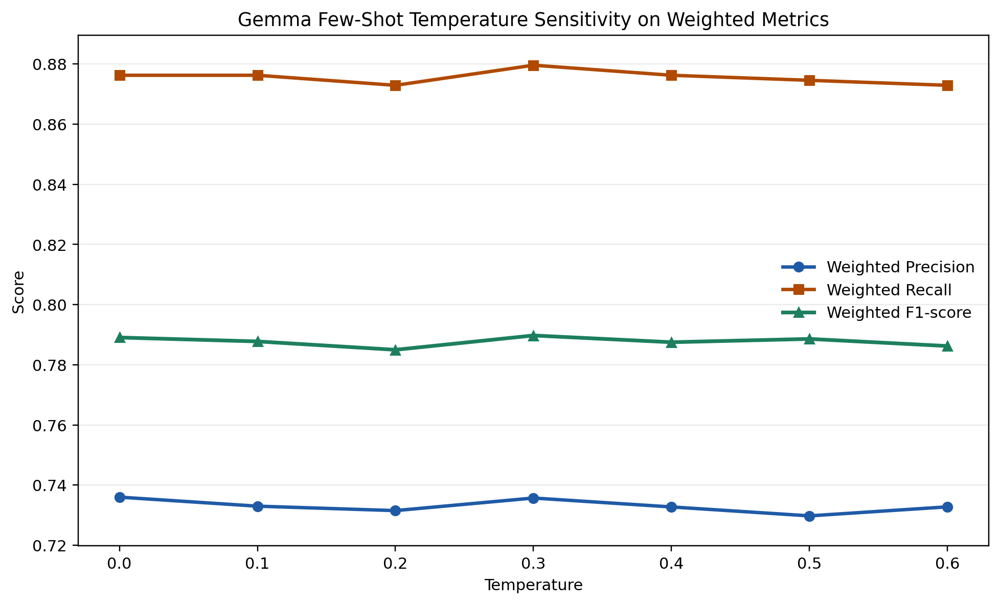
<p>The median Weighted F1 varies from <strong>0.785</strong> at <strong>T=0.2</strong> to <strong>0.790</strong> at <strong>T=0.3</strong>, yielding an absolute gap of <strong>0.005</strong> and a relative variation of <strong>0.60%</strong>. Weighted Precision varies by <strong>0.006</strong> across temperatures, and Weighted Recall varies by <strong>0.007</strong>.</p>
</td>
<td valign="top" width="33%">
<p><strong>Qwen Few-Shot</strong></p>
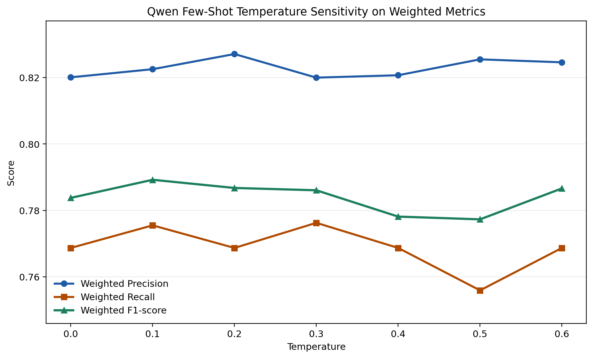
<p>The median Weighted F1 varies from <strong>0.777</strong> at <strong>T=0.5</strong> to <strong>0.789</strong> at <strong>T=0.1</strong>, yielding an absolute gap of <strong>0.012</strong> and a relative variation of <strong>1.52%</strong>. Weighted Precision varies by <strong>0.007</strong> across temperatures, and Weighted Recall varies by <strong>0.020</strong>.</p>
</td>
</tr>

</table>
